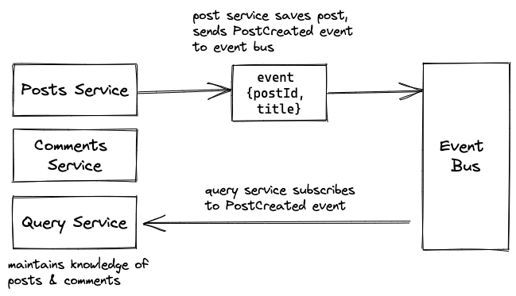
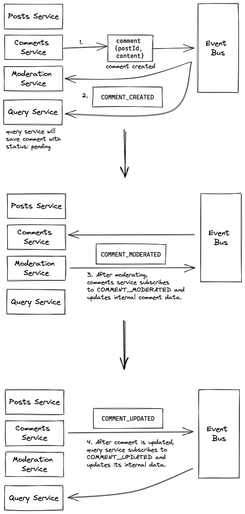

# Microservices Toy Blog App w/ Stephen Grider

## General Architecture

- The features of the blog are to allow a user to create posts and add comments to these posts.
- The posts and comments services keep internal track of the posts and comments that have been created so far, but **the client does not read from these services.**

- The client makes GET requests to `QUERYSERVICE/posts`, which keeps itself updated on both posts and comments by subscribing to `POST_CREATED` and `COMMENT_CREATED` events, which are emitted by the post and comment services respectfully, and distributed by the event bus service.

## What if we want to add comment moderation?

- We could create another moderation service, which now also listens to `COMMENT_CREATED` events.
  - The query service would first save these comments in its internal stores as having a status of `pending`, and then would be updated on some other event such as `COMMENT_MODERATED`.
  - The issue with this approach is that **we do not want business logic in a query service**, which should really only serve one purpose *(especially if our logic gets more and more complex).*
- We should really have the comments service deal with comment business logic!
  - We’ll have the comments service subscribe to the `COMMENT_MODERATED` event, and have it emit a generic `COMMENT_UPDATED` event once it handles the `COMMENT_MODERATED` event however it would like.
    - This way, all the comment business logic is abstracted, allowing other services to interact with comments without having to know anything about the internal business logic.

## How do we deal with services going down?

- What happens if a service goes down for a while, or if a new service is added later in the lifecycle of an app?
  - The previous events that happened when the new/down service wasn’t up will be lost to time.
- We can add a data store in the form of a database to the event bus, so that we have a history of the events we have sent!
  - Now, new services can go through all events of the past, and services that went down can look up all of the events that occurred while it was down.
- Whenever a service comes online, we can have it ask the event bus to send it any of the events it may have missed since it last went offline.
